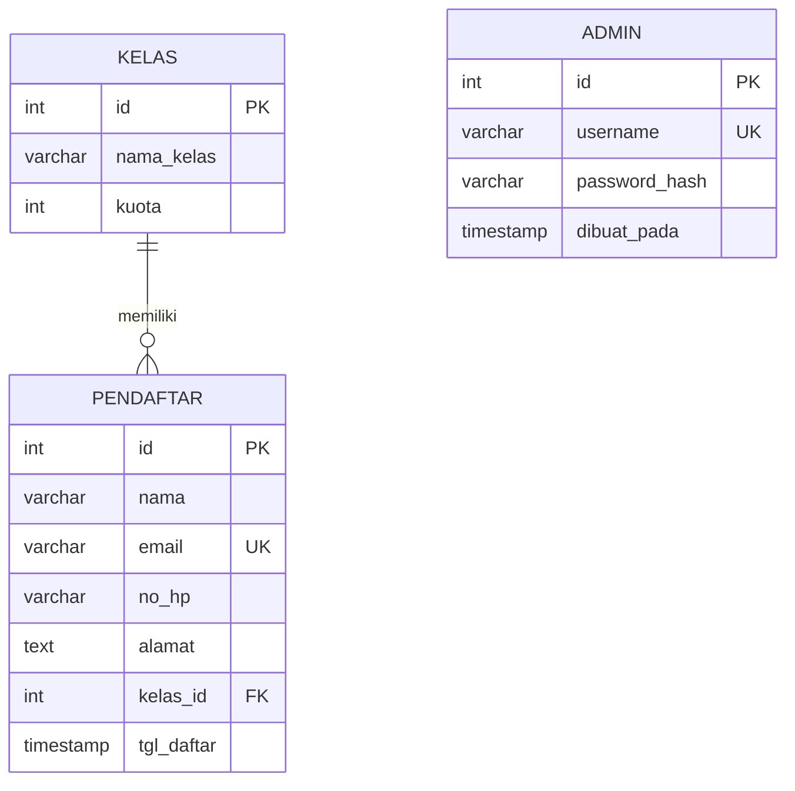

# ERD Sprint 0

```mermaid
erDiagram
    KELAS ||--o{ PENDAFTAR : memiliki
    KELAS {
        int id PK
        varchar nama_kelas
        int kuota
    }
    PENDAFTAR {
        int id PK
        varchar nama
        varchar email UK
        varchar no_hp
        text alamat
        int kelas_id FK
        timestamp tgl_daftar
    }
    ADMIN {
        int id PK
        varchar username UK
        varchar password_hash
        timestamp dibuat_pada
    }
```
